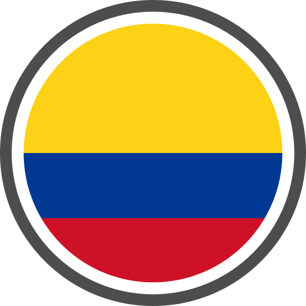
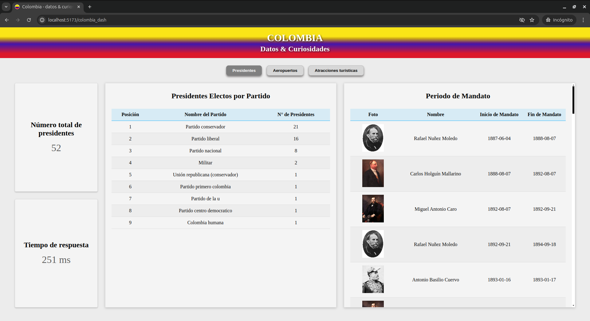
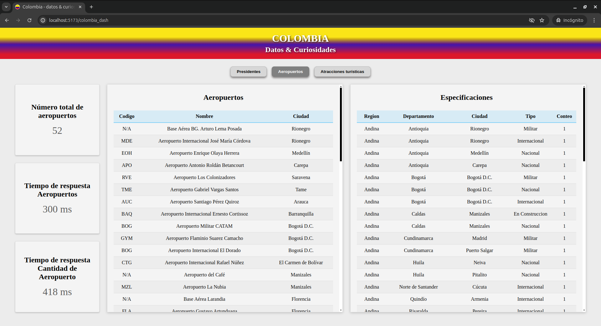
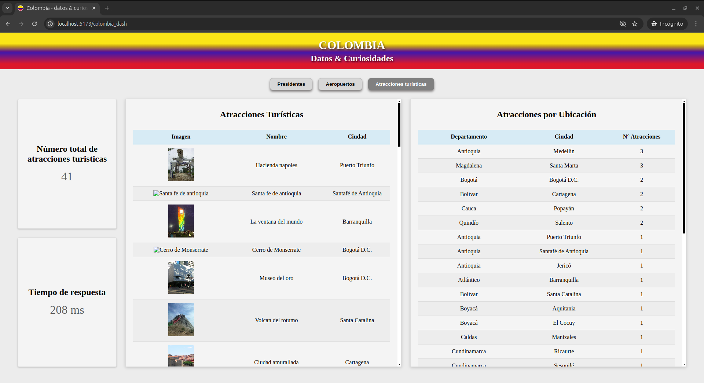

<a name="inicio"></a>

<div align="center">
    <p><strong>Links de Contacto</strong></p>
    <a href="https://drive.google.com/file/d/1Pe-UKjdPGVZC53y1DmgpNwx3PUDryUd4/view?usp=sharing" target="_blank" rel="noopener noreferrer">
        
    </a>
    <a href="https://portafolio-rafael-mojica.vercel.app/" target="_blank" rel="noopener noreferrer">
        
    <a/>
    <a href="https://www.linkedin.com/in/rafamojica/" target="_blank" rel="noopener noreferrer">
        
    </a>
    <a href="https://github.com/RafaMojica" target="_blank" rel="noopener noreferrer">
        
    </a>
</div>

##

<div align="center">
    
</div>

<div align="center">
    <h3>Prueba Tecnica </br> Datos & Curiosidades Colombia</h2>
</div>

## Tabla de contenido

<ol>
  <li>
    <a href="#descripción-del-proyecto">Descripción del Proyecto</a>
    <ul>
      <li><a href="#tecnologías-utilizadas">Tecnologías utilizadas</a></li>
    </ul>
  </li>
  <li>
    <a href="#cómo-empezar">Cómo Empezar</a>
    <ul>
      <li><a href="#instalación">Instalación</a></li>
    </ul>
  </li>
    <li>
    <a href="#diseño-web">Diseño Web</a>
    <ul>
      <li><a href="#entidad-presidentes">Entidad Presidentes</a></li>
      <li><a href="#entidad-aeropuertos">Entidad Aeropuertos</a></li>
      <li><a href="#entidad-atracciones-turisticas">Entidad Atracciones Turisticas</a></li>
    </ul>
  </li>
</ol>

## Descripción del proyecto

Sitio Web que permite al usuario ver datos importantes y algunas curiosidades de Colomabia, proyecto realizado consumiendo la <a href="https://api-colombia.com/">API COLOMBIA</a> y trayendo algunos datos de ella.

### Tecnologías utilizadas

|            |                 |
| :--------: | :-------------: |
| JavaScript | reac-router-dom |
|   React    |       Css       |
| Prop-types |      Vite       |
|            |                 |

<p align="right"><a href="#inicio">⬆ Volver al inicio</a></p>

## Cómo Empezar

Este proyecto aún no está desplegado, pero puedes probarlo en tu local. Siga las siguientes instrucciones para ejecutarlo.

### Instalación

1. Clona el repositorio
   ```sh
   git clone https://github.com/RafaMojica/colombian_api_Rafael.git
   ```
2. entra la carpeta e instala las dependencias NPM

   ```sh
   npm install
   ```

3. Crea un archivo en el root **.env** después usa como base el archivo **.env.example** que se encuentra en este repositorio

   ```sh
   VITE_URL_API_COLOMBIA=https://api-colombia.com/api/v1
   ```

4. Corre el Servidor
   ```sh
   npm run dev
   ```

5. Abre la Pagina web en la siguiente url
   ```sh
   http://localhost:5173/
   ```

<p align="right"><a href="#inicio">⬆ Volver al inicio</a></p>

## Diseño Web

### Entidad Presidentes

<div align="center">
    
</div>

### Entidad Aeropuertos

<div align="center">
    
</div>

### Entidad Atracciones Turisticas

<div align="center">
    
</div>

</br>
<p align="right"><a href="#inicio">⬆ Volver al inicio</a></p>
